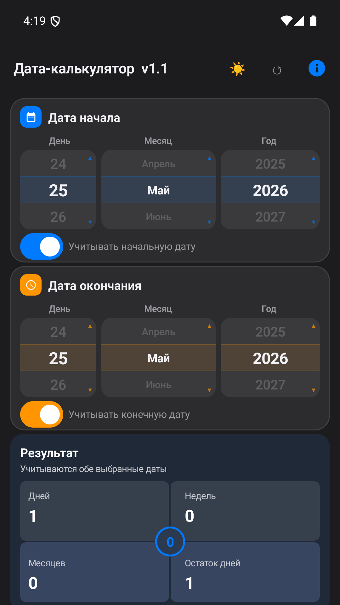
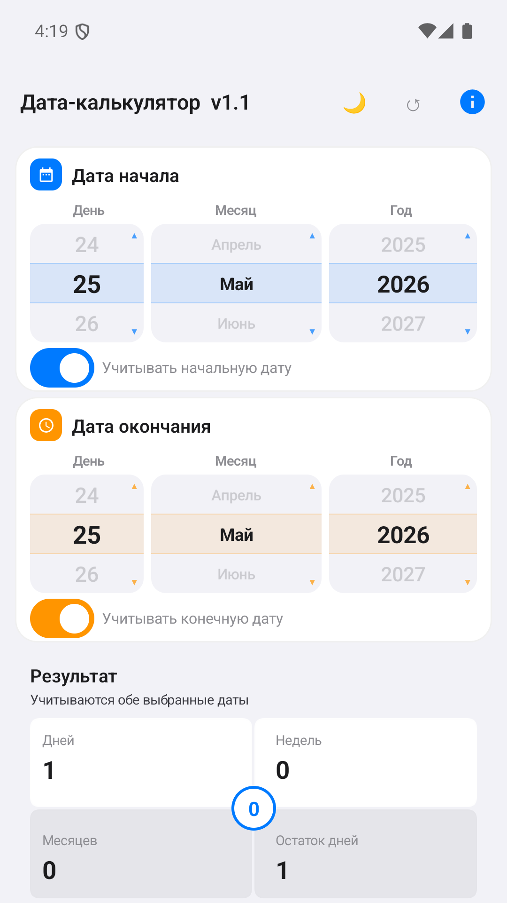

# Дата-калькулятор

> 💛 Поддержать проект: [ЮMoney](https://yoomoney.ru/to/410018488997376)

Android-приложение для точного расчёта интервала между датами: дни, недели, полные месяцы и остаток дней.

## Возможности

- 📅 **Колёсные селекторы дат** — интуитивный выбор даты скроллом
- 🔢 **Точный расчёт** — дни, недели, полные месяцы + остаток дней
- ⚙️ **Гибкий учёт границ** — включить/исключить начальную и конечную дату
- 🔄 **Обратный расчёт** — прошедшие события показывают отрицательное значение
- 🧮 **Високосные годы** — корректный учёт високосных годов и дней в месяце
- 📱 **Виджет** — показывает количество дней до выбранной даты на главном экране (Jetpack Glance)
- 🌗 **Тёмная и светлая тема** — автоматическое переключение
- 🔒 **Без рекламы и сбора данных** — только INTERNET разрешение для myTarget (опциональная монетизация)

## Скриншоты

| Светлая тема | Тёмная тема |
|--------------|-------------|
|  |  |

**Расчёт 3 лет** — 

## Технологии

- **Kotlin** + **Jetpack Compose** (Material 3)
- **Jetpack Glance** — виджет для главного экрана
- **VK Ads (myTarget)** — опциональная реклама
- Min SDK 21, Target SDK 34
- Android 5.0+

## Сборка

```bash
# Клонировать репозиторий
git clone https://github.com/namotoff/DateCalcAndroid.git
cd DateCalcAndroid

# Сборка debug APK (без подписи)
./gradlew assembleDebug
# APK: app/build/outputs/apk/debug/app-debug.apk

# Сборка release APK (нужен keystore)
./gradlew assembleRelease
# APK: app/build/outputs/apk/release/app-release.apk
```

Для release-сборки создай `keystore.properties` в корне проекта:
```properties
storeFile=keystore/datecalc-release.jks
storePassword=****
keyAlias=datecalc
keyPassword=****
```

## Установка

APK доступен в [RuStore](https://www.rustore.ru/catalog/app/com.datecalc) и в [GitHub Releases](../../releases).

## Политика конфиденциальности

https://namotoff.github.io/datecalc-privacy/

## Лицензия

Apache License 2.0 — см. [LICENSE](LICENSE).

## Контакты

Email: edazin@bk.ru
